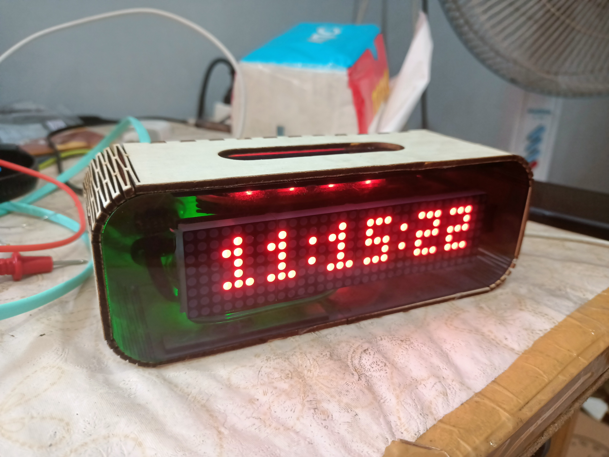
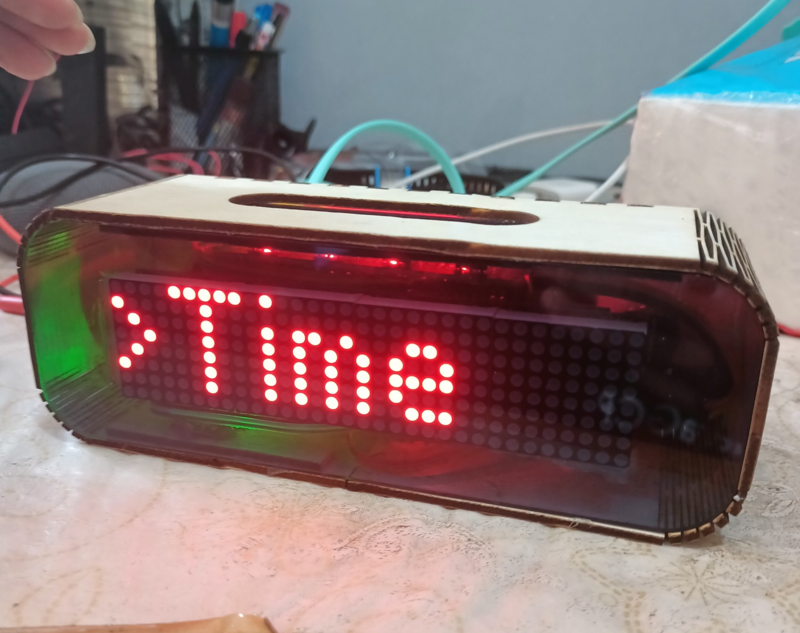

# Arduino AlarmClock

Arduino-based AlarmClock. It uses my own simple framework to manage the view. It has same lifecycle as Android. This project created as part of Embedded System Final Project.

## Final Product

  
  

